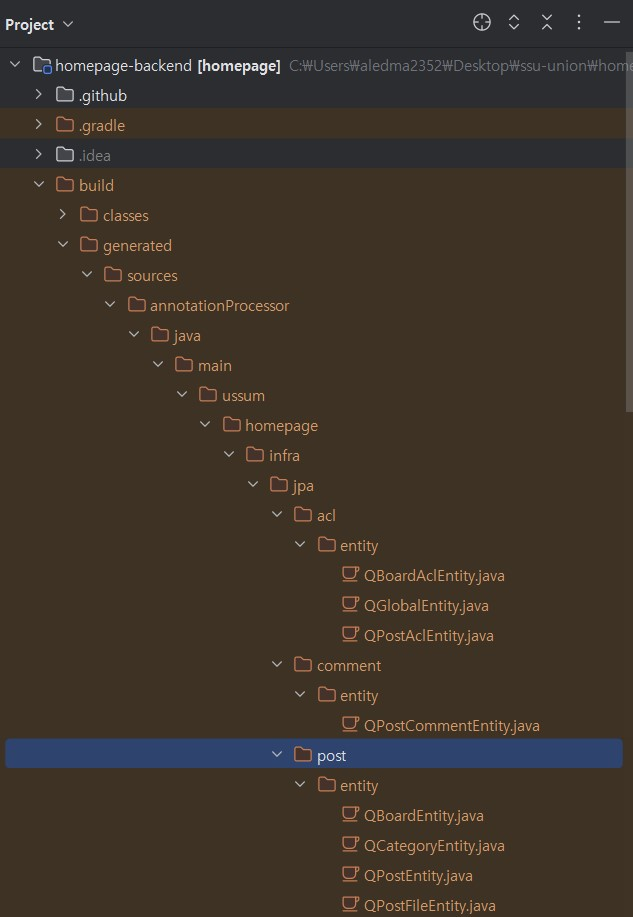

# QueryDSL code 예시

### 의존성 주입
```java
dependencies {
	// queryDSL
	implementation 'com.querydsl:querydsl-jpa:5.0.0:jakarta'
    // querydsl  JPAAnnotationProcessor 사용 지정
    annotationProcessor "com.querydsl:querydsl-apt:${dependencyManagement.importedProperties['querydsl.version']}:jakarta" 
	// annotationProcessor "com.querydsl:querydsl-apt:5.0.0:jakarta"
	annotationProcessor "jakarta.annotation:jakarta.annotation-api" // java.lang.NoClassDefFoundError (javax.annotation.Generated) 대응 코드
	annotationProcessor "jakarta.persistence:jakarta.persistence-api" // java.lang.NoClassDefFoundError (javax.annotation.Entity) 대응 코드
}

// gradle clean 시에 QClass 디렉토리 삭제
clean {	
    delete file('src/main/generated')
} 

```

### 1. Q클래스 생성하기


- 인텔리제이의 오른쪽 Gradle 탭에서 clean 실행 후 build를 실행한다.
- 위와 같이 하면 프로젝트의 build -> generated에서 JPA entity class를 생성했던 디렉토리 명과 동일한 디렉토리에 Q클래스가 생성된다.



### 2. QueryDSL Configuration
- 프로젝트에서 QueryDSL을 사용하기 위해선 QueryDSL 설정이 필요하다.
- 따라서, 아래와 같이 JPAQueryFactory를 Bean으로 등록한다.
```java
@Configuration
@RequiredArgsConstructor
public class QueryDSLConfig {
    private final EntityManager entityManager;

    @Bean
    public JPAQueryFactory jpaQueryFactory(){
        return new JPAQueryFactory(entityManager);
    }
}
```

### 3. 